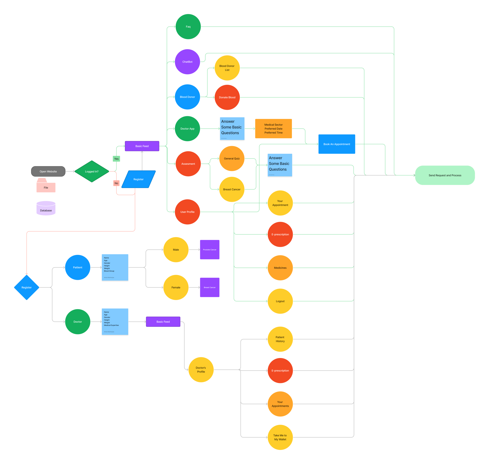

   
   
   <h1 align="center"> Health-e </h1>
   <h3 align="center"> Your All-in-One Health Resource </h3>
   

   
   ## What is Health-e all about? 🤔 
   ### Welcome to Health-e, your ultimate healthcare companion. Our all-in-one website simplifies your healthcare experience by offering a range of essential services. Book doctor's appointments seamlessly, find blood donors in your area, predict potential diseases using our advanced algorithm, and generate e-prescriptions with just a few clicks. We also understand the importance of mental health, which is why we provide an AI chatbot dedicated to supporting individuals facing depression. Our website is here to streamline your healthcare journey and empower you to take control of your well-being.

<h2> Features 🚀 </h2> 
<h3> 1. Doctor's appointment portal </h3>
<h3> 2. Blood Donar portal </h3>
<h3> 3. Cheapest Medicine </h3>
<h3> 4. Disease Detection </h3>
<h3> 5. AI Chatbot for Individuals suffering from Depression </h3>

## FlowChart of our website 📈

<h2>Technologies Used! 👨‍💻</h2>

<h3> FrontEnd: </h3>

 

<h3> BackEnd: </h3>

<h3> Machine Learning: </h3>

<h2> FAQ's related to Health-e </h2>
<h4> 1.  How can I book an appointment with a doctor through your website?</h4>

To book an appointment on our website, register as a user and answer questions about your health concerns and preferences. We'll match you with the right specialist and present a list of available doctors. Review their profiles and select the most suitable one. Finally, choose a convenient date and time for your appointment.

<h4> 2. How can I find a blood donor for my specific blood type?</h4>

Our website features a comprehensive database of registered blood donors. You can search for blood donors based on their blood type, location, and availability. Simply enter your requirements, and the system will display a list of potential donors matching your criteria.

<h4> 3. How can the AI chatbot help individuals suffering from depression?</h4>

 Our AI chatbot for depression provides support and guidance to individuals by offering empathetic responses, coping strategies, and suggestions for seeking professional help. It aims to help manage depressive symptoms through compassionate interaction and practical recommendations. 

 
<H2> Our Team! ⭐</H2>

<h3><u> Prabuddha Chowdhury</u> </h3>

<h4> BackEnd Developer </h4>

<h3> <u>Supriyo Saha </u></h3>

<h4> FrontEnd Developer</h4>

<h3><u> Dipanjan Dhar </u></h3>

<h4> BackEnd Developer </h4>

<h2> Challenges Faced! </h2>

 Integrating various systems, such as appointment scheduling, donor databases, and disease prediction algorithms, can be challenging. Ensuring seamless data exchange and interoperability between different components requires careful planning and standardized protocols. 
 

 Designing a user-friendly interface that caters to different user groups, including patients, doctors, and blood donors, is crucial. Balancing simplicity and ease of use with the complexity of medical processes and data requires careful UX/UI design and continuous user testing.

   
   

